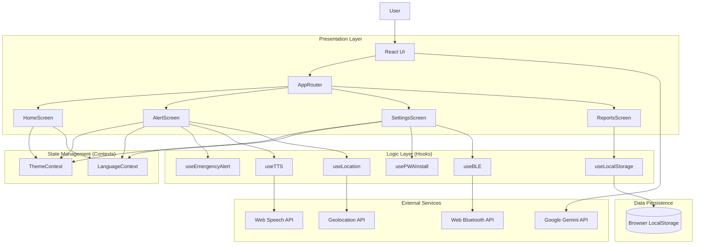
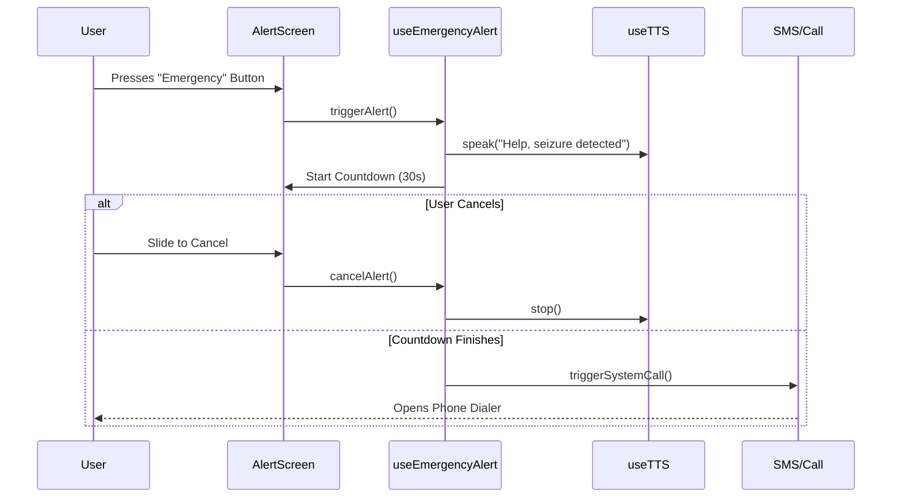

# Architecture Documentation

## System Overview

**Aura Speaks AI** is a **Local-First, Progressive Web App (PWA)** designed for seizure safety. It prioritizes privacy, reliability, and offline capability.

### Core Principles

1. **Local First**: All data (contacts, logs, settings) is stored in the browser's `localStorage` or `IndexedDB`. No remote database.
2. **Privacy**: No PII is ever transmitted to a server.
3. **Resilience**: The app must function 100% offline (except for AI features).

## Component Architecture



## Data Flow

### Emergency Alert Flow



## CI/CD Pipeline

The project uses GitHub Actions for continuous integration and deployment.

```mermaid
flowchart LR
    Push[Git Push] --> CI[CI Pipeline]

    subgraph "CI Jobs"
        CI --> Lint[Lint & Format]
        CI --> Test[Unit Tests]
        CI --> Build[Build App]
        CI --> Audit[Security Audit]
    end

    Test -->|Success| Deploy[Deploy (gh-pages)]
    Lint -->|Failure| Reject[Reject Commit]
```
