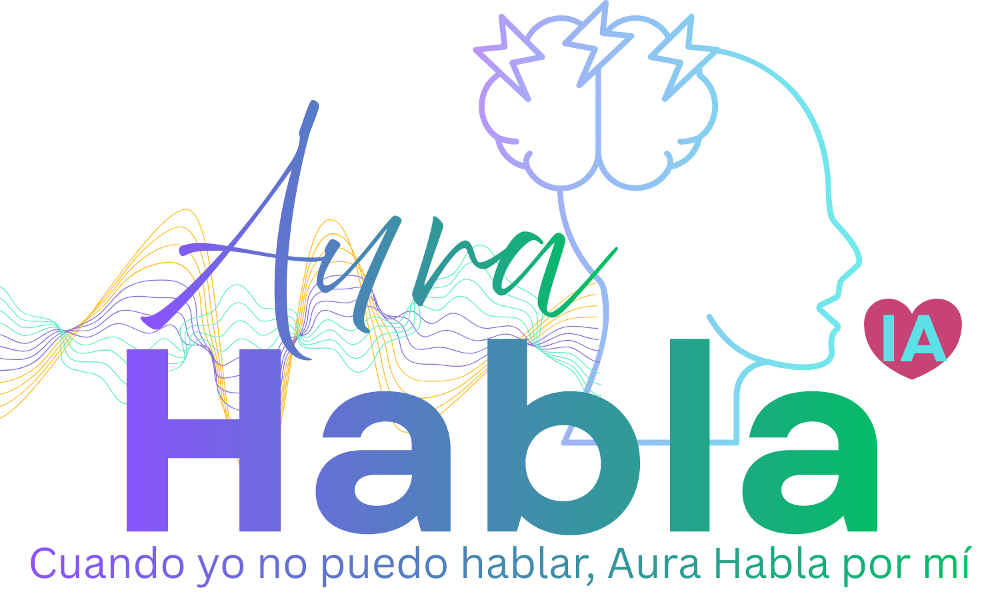

# Aura Speaks AI 🗣️🚨

> **"Cuando no puedo hablar, Aura habla por mí."**
>
> _Esta aplicación nació de un momento de impotencia. Tuve una casi convulsión mientras comía un sándwich y un café en el aeropuerto de Medellín. De repente, me golpeó. Perdí la capacidad de hablar. Saqué mi teléfono, pero ¿a quién llamar? ¿A mi novia a una hora de distancia? Necesitaba comunicarme, pero mi mente estaba inundada con miles de pensamientos y déjá vus, incapaz de encontrar la palabra 'convulsión'. Bebí mi café rápidamente y los síntomas se desvanecieron un poco, estabilizándome. Al sentirme mejor, abrí mi laptop justo ahí en el aeropuerto y comencé a prototipar esta aplicación. Ya no se trataba del café; en esa fracción de tiempo 'Aura', todo lo que buscamos es una forma de alzar la voz._

**Un diario de convulsiones y asistente simple que salva vidas. Alerta, registra y habla por ti cuando tú no puedes.**

🌐 **Haz clic aquí para abrir la App:** [Lanzar Aura Speaks AI](https://ramonriosjr.github.io/seizure-alert-app/)

Desarrollado por **[Coqui Cloud Dev Co.](https://coqui.cloud)** | [RamonRios.net](https://ramonrios.net)

---

## 📱 Características Clave (Simple y Fácil)

### 🆘 El "Gran Botón Rojo"

- **Ayuda con Un Toque:** Simplemente presiona el botón rojo grande si sientes que viene una convulsión.
- **Seguro:** Tienes que deslizar para cancelar, para no llamar por accidente.
- **Alerta Ruidosa:** La pantalla parpadea y hace un ruido fuerte para llamar la atención de las personas.
- **Llamada Automática:** Si no lo detienes, llama a tu contacto de emergencia automáticamente después de 30 segundos.

### 🏥 Ayudando a los Ayudantes (Testigos)

- **Habla por Ti:** El teléfono habla en voz alta, diciéndole a la gente exactamente qué hacer (como "Gírelos sobre su lado").
- **Funciona Sin Conexión:** Incluso si no tienes internet, las instrucciones de voz siguen funcionando.
- **Info Médica:** Muestra tu Nombre, Tipo de Sangre y Alergias en la pantalla.

### 🔋 Gestión de Energía de Grado Empresarial

- **Telemetría Unificada:** Monitoreo centralizado del estado de la batería, tasas de descarga (% por hora) y tiempo de ejecución estimado.
- **Continuidad de Sensores:** Integración de la API "Wake Lock" para evitar que el sistema operativo entre en modo de espera durante el monitoreo activo.
- **Optimización de Rendimiento:** Herísticas de Modo de Bajo Consumo para reducir la carga de CPU fuera de los períodos críticos de monitoreo.

### 🤖 Asistencia Inteligente de Salud

- **Aura Seizure (Estándar):** Optimizado para la gestión de la epilepsia. Incluye terminología de "Convulsión" y herramientas de respuesta rápida.
- **Aura Senior (Seguridad ante Caídas):** Optimizado para el cuidado de adultos mayores. Incluye terminología de "Emergencia", texto más grande y controles simplificados de Detección de Caídas.
- **Centro de Comando Adaptativo:** Transición a un sistema de cuadrícula modular enfocado en una navegación fácil. Los bloques principales incluyen:
  - **Fila 1 (Núcleo de Vida):** Paciente (Bóveda Médica) | Contactos (Círculo de Cuidado) | Seguridad (Alertas)
  - **Fila 2 (Inteligencia):** **Aura IA (API Gemini)** | Dispositivos (Hardware) | Cuidado del Teléfono (Batería/Telemetría)
  - **Fila 3 (Clínica):** Calendarios | Medicación | Doctores (Directorio de Especialistas)

### ⚙️ Fácil de Instalar (PWA)

- **No Necesita App Store:** Puedes instalar esto directamente desde tu navegador.
- **iPhone y Android:** Funciona en casi cualquier teléfono.
- **Botón de Instalación Manual:** Ve a **Configuración** > **Instalación de la App** para ver un gran botón de "Instalar" o instrucciones para tu teléfono.

### 📡 Nuevo: Toque para Alertar (NFC)

- **Inicio Instantáneo:** ¡Puedes programar una etiqueta NFC barata (pegatina) para que simplemente _tocando_ tu teléfono con ella se inicie la alarma inmediatamente! ¡Ideal para mesitas de noche!

### 📉 Nuevo: Visualizador de Detección de Caídas y "Snooze"

- **Modo de Prueba:** Visualiza los datos de los sensores de tu teléfono en tiempo real para verificar que la Detección de Caídas funciona sin lastimarte.
- **Posponer Inteligente:** Evita la "Fatiga de Alertas" posponiendo las alertas de ritmo cardíaco alto por 15 minutos si estás a salvo.

---

## 🚀 Disponibilidad de la Plataforma

Aura Speaks AI está diseñado para ofrecer fiabilidad de grado de producción en entornos web y móviles modernos.

- **✅ Certificación PWA:** Instalable en iOS (Safari) y Android (Chrome) con capacidades completas sin conexión.
- **✅ Núcleo Globalizado:** Soporte de internacionalización (i18n) endurecido para inglés y español (Listo para regulaciones).
- **✅ Rendimiento Optimizado:** Ajustado para respuesta de baja latencia en iPhone 11+ y hardware Android contemporáneo.
- **✅ Tipado Seguro:** Implementación 100% TypeScript con cumplimiento arquitectónico estricto.

---

## 🗺️ Hoja de Ruta del Proyecto

Consulta nuestra [Hoja de Ruta Técnica](./ROADMAP.md) para conocer las mejoras arquitectónicas planificadas, incluyendo la expansión de la cobertura de pruebas y la integración con dispositivos wearables.

---

## 🛠️ Instrucciones de Uso

1. **Abre la App**: Haz clic en el enlace de arriba.
2. **Añade Contactos**: Ve a la **Configuración (Icono de Engranaje)** ⚙️ y añade los detalles de tu Médico especializado o Familiar.
3. **Instálalo**: Busca el botón "Instalar App" en Configuración para guardarlo en tu teléfono.
4. **Pruébalo**: Presiona el Botón Rojo para escuchar la alarma y las instrucciones (Desliza para cancelar).

---

## 🔒 Privacidad y Seguridad

**"Primero lo Local, Siempre la Privacidad."**

- **Tus Datos Se Quedan Contigo:** Todos tus contactos e información médica se guardan **solo en tu teléfono**. Nosotros no los vemos. No los robamos.
- **Sin Rastreo:** No rastreamos a dónde vas ni qué haces.
- **Amigable con HIPAA:** Dado que no almacenamos tus datos, tu privacidad está segura.

---

## ⚠️ Aviso Médico

**Esto NO es un dispositivo médico certificado.**
Es una herramienta informativa para ayudar a atraer la atención y guiar a las personas que te ayudan. **Llama siempre al 911 (o a tu número de emergencia local)** en una emergencia médica real.

---

## 🤝 Apoya la Misión

Este proyecto es una labor de amor, pero cuesta dinero mantenerlo en línea (servidores, costos de IA y café).

Si esta herramienta te da tranquilidad, por favor considera invitarme un café para mantenerla funcionando.

**[☕ Haz clic aquí para Invitarme un Café](https://buymeacoffee.com/RamonRiosJr)**

---

## ✨ Conoce al Creador

  
  
### 📂 Estructura Modular

- `src/`: **Código Núcleo de la App** (Estructura estándar React/Vite).
- `src/components/layout`: Lógica global (Shake, URL Params) separada de la UI.
- `src/router`: `AppRouter` dedicado para gestión de pantallas.
- `src/contexts`: Gestión de estado vía React Context (UI, Tema).
- **[Ver Arquitectura del Sistema](./docs/ARCHITECTURE.md)**: Desglose detallado del modelo de configuración Hub-and-Spoke y flujo de datos.

> **"No podemos controlar los desafíos que enfrentamos, pero podemos controlar cómo respondemos. Deja que esta herramienta sea tu voz cuando más la necesites."**
>
> — _Ramon Rios Jr_

 

---

## 📄 Licencia

**Licencia Pública General GNU v3.0 (GPLv3)** © 2025 Ramon Rios @ Coqui Cloud
Este proyecto es libre y abierto para todos.
