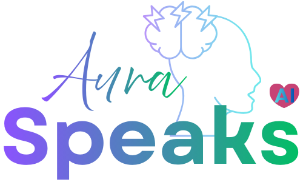

# Aura Speaks AI 🗣️🚨

> **"When I cannot speak, Aura speaks for me."**
>
> _This app was born from a moment of helplessness. I had a near seizure while eating a sandwich and coffee at the airport in Medellin. Suddenly, it hit me. I lost my ability to speak. I pulled out my phone, but to call who? My girlfriend, an hour away? I needed to communicate, but my mind was racing. I drank my coffee rapidly, and the symptoms faded. As I felt better, I opened my laptop right there in the airport and started prototyping this app. It wasn't about the coffee anymore; in that fraction of 'Aura' time, all we look for is a way to speak up._

**A simple, life-saving seizure diary and assistant. It alerts, logs, and speaks for you when you can't.**

🌐 **Click here to open the App:** [Launch Aura Speaks AI](https://ramonriosjr.github.io/seizure-alert-app/)

Developed by **[Coqui Cloud Dev Co.](https://coqui.cloud)** | [RamonRios.net](https://ramonrios.net)

---

## 📱 Key Features (Simple & Easy)

### 🆘 The "Big Red Button"

- **One-Tap Help:** Just press the big red button if you feel a seizure coming.
- **Safe:** You have to slide to cancel, so you don't call by accident.
- **Loud Alert:** It flashes the screen and makes a loud noise to get people's attention.
- **Automatic Call:** If you don't stop it, it calls your emergency contact automatically after 30 seconds.

### 🏥 Helping the Helpers (Bystanders)

- **Talks for You:** The phone speaks out loud, telling people exactly what to do (like "Turn them on their side").
- **Works Offline:** Even if you have no internet, the voice instructions still work.
- **Medical Info:** Shows your Name, Blood Type, and Allergies on the screen.

### 🎭 Senior-Centric Information Architecture

- **Aura Seizure (Standard):** Optimized for epilepsy management. Features "Seizure" terminology and rapid response tools.
- **Aura Senior (Fall Safety):** Optimized for elderly care. Features "Emergency" terminology, larger text, and simplified Fall Detection controls.
- **Adaptive Command Center (Aura 2.0):** Transitions to a high-impact, modular grid system focused on user-friendly navigation. The core blocks include:
  - **Row 1 (Life Core):** Patient (Medical Vault) | Contacts (Circle of Care) | Safety (Alerts)
  - **Row 2 (Intelligence):** **Aura AI (Gemini API Field)** | Devices (Hardware) | Phone Care (Battery/Telemetry)
  - **Row 3 (Clinical):** Calendars | Medication | Doctors (Specialist Directory)

### ✅ Health Command Center (Grid UI)

- **Modular Dashboard:** A responsive, adaptive grid system for quick access to critical functions.
- **Modern Navigation:** Persistent bottom tab bar for seamless switching between Dashboard, Medications, Calendar, and Settings.
- **Panic Interaction:** Adaptive emergency button placement for accessibility.

### 🔋 Enterprise-Grade Power Management

- **Unified Telemetry:** Front-and-center monitoring of battery health, discharge rates (% per hour), and estimated runtime.
- **Sensor Continuity:** Integrated "Wake Lock" API to prevent OS-level sleep during active monitoring.
- **Performance Optimization:** Low Power Mode heuristics to reduce CPU overhead when outside critical monitoring windows.

### 🤖 Intelligent Health Assistance

- **Context-Aware AI:** Leveraging the `gemini-1.5-flash` engine for localized first aid guidance.
- **Secure Onboarding:** A guided "Connect Aura AI" wizard simplifies client-side API integration with automated validation.
- **Privacy-First Architecture:** Zero-trust model where all keys and medical logs are persisted exclusively in secure local storage.
- **Medical Vault Security:** Mandatory PIN-gate for sensitive patient data, satisfying FDA/HIPAA-grade privacy expectations.

### 📉 New: Fall Detection Visualizer & Snooze

- **Test Mode:** Visualize your phone's sensor data in real-time to verify Fall Detection works without hurting yourself.
- **Smart Snooze:** Prevent "Alert Fatigue" by snoozing high heart rate alerts for 15 minutes if you are safe.

### ✅ "I'm Safe" Check-in Button

- **False Alarm? No Problem:** Quickly notify your emergency contact that you are okay.
- **One-Tap SMS:** Sends a pre-filled "I am safe" message with your location (via SMS app) to your primary contact.
- **Reduces Anxiety:** Helps prevent caregiver fatigue from accidental alerts.

---

## � Platform Readiness

Aura Speaks AI is engineered for production-grade reliability across modern web and mobile environments.

- **✅ PWA Certified:** Installable on iOS (Safari) and Android (Chrome) with full offline-first capabilities.
- **✅ Globalized Core:** Hardened internationalization support for English and Spanish (Regulatory Ready).
- **✅ Performance Tuned:** Optimized for low-latency response on iPhone 11+ and contemporary Android hardware.
- **✅ Type Safe:** 100% TypeScript implementation with strict architectural enforcement.

---

## 🗺️ Project Roadmap

View our [Technical Roadmap](./docs/ROADMAP.md) for planned architectural enhancements, including coverage expansion and wearable integration.

---

## 💻 Tech Stack

Built with modern, production-grade tools to ensure speed, safety, and scalability.

- **Core:** React 18, TypeScript, Vite
- **Styling:** Tailwind CSS v4, PostCSS, Lucide React (Icons)
- **State & Internationalization:** React Context API, i18next (English/Spanish)
- **PWA (Progressive Web App):** Vite PWA Plugin, Service Workers (Offline Capability)
- **Testing:** Playwright (E2E), Vitest (Unit - located in `test/`), Testing Library
- **Quality:** ESLint (Strict), Prettier, Husky (Pre-commit hooks), Axe-Core (A11y)
- **Deployment:** GitHub Pages (CI/CD)

---

## 🏗️ Engineering & Documentation

This project follows **Clean Architecture** principles and maintains rigorous medical-grade standards.

### 📚 Technical Resources

- **[System Architecture](./docs/ARCHITECTURE.md)**: Detailed breakdown of the Hub-and-Spoke settings model and data flow.
- **[Project Roadmap](./docs/ROADMAP.md)**: Strategic objectives and specialized version development.
- **[Project Backlog](./docs/BACKLOG.md)**: Mission-critical task tracking and transparency.
- **[Accessibility (A11y)](./docs/ACCESSIBILITY.md)**: Compliance standards for senior-centric user interfaces.

### 📂 Modular Structure

- `components/layout`: Global logic listeners (Shake, URL Params) detached from UI.
- `router`: Dedicated `AppRouter` for reactive screen management.
- `contexts`: State management via React Context (Safety, UI, Theme).

### 🛡️ Quality Assurance

- **CI/CD**: Enterprise-grade GitHub Actions pipeline runs `npm test`, `lint`, and `type-check` on every Pull Request.
- **Accessibility**: Built with **WCAG AA** standards in mind, verified by `axe-core`.
- **Unit Tests**: Critical logic (`useFallDetection`, `useHeartMonitor`, `useLocalStorage`) is fully tested.

---

---

## 🛠️ Instructions for Use

1. **Open the App**: Click the link above.
2. **Add Contacts**: Go to the **Settings (Gear Icon)** ⚙️ and add your specialized Doctor or Family member details.
3. **Install It**: Look for the "Install App" button in Settings to save it to your phone.
4. **Test It**: Press the Red Button to hear the alarm and instructions (Slide to cancel).

---

## 🔒 Privacy & Safety

**"Local First, Privacy Always."**

- **Your Data Stays With You:** All your contacts and medical info are saved **only on your phone**. We don't see it. We don't steal it.
- **No Tracking:** We don't track where you go or what you do.
- **HIPAA Friendly:** Since we don't store your data, your privacy is safe.

---

## ⚠️ Medical Disclaimer

**This is NOT a certified medical device.**
It is an information tool to help attract attention and guide people helping you. **Always call 911 (or your local emergency number)** in a real medical emergency.

---

## 🤝 Support My Mission

This project is a labor of love, but it costs money to keep online (servers, AI costs, and coffee!).

If this tool gives you peace of mind, please consider buying me a coffee to keep it going.

**[☕ Click here to Buy Me a Coffee](https://buymeacoffee.com/RamonRiosJr)**

---

---

## 📄 License

**GNU General Public License v3.0 (GPLv3)** © 2025 Ramon Rios @ Coqui Cloud
This project is free and open for everyone.
