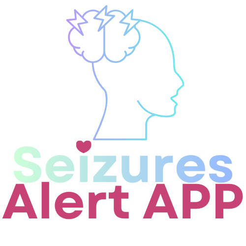

# Seizure Alert App 🚨

  

> **"My Story, My Mission"**  
> _This app was born from a moment of helplessness. I had a near seizure while eating a sandwich and coffee at the airport in Medellin. Suddenly, it hit me. I lost my ability to speak. I pulled out my phone, but to call who? My girlfriend, an hour away? I needed to communicate, but my mind was flooded with thousands of thoughts and déjá vus, unable to find the word 'seizure'. I drank my coffee rapidly, and the symptoms faded slightly, stabilizing me. All I needed in that moment was a **Button** to press so others could identify what was happening and help me._

**A life-saving PWA tool to help individuals alert bystanders during a seizure, providing clear instructions and an AI assistant for first-aid information.**

🌐 **Live App:** [https://ramonriosjr.github.io/seizure-alert-app/](https://ramonriosjr.github.io/seizure-alert-app/)

Developed by **[Coqui Cloud Dev Co.](https://coqui.cloud)** | [RamonRios.net](https://ramonrios.net)

---

## 📱 Features

### 🆘 Emergency Response

* **One-Tap Activation:** Large, pulsing emergency button for instant access.
* **Slide-to-Cancel:** Prevent accidental calls with a secure slide gesture.
* **Auto-Call Protocol:** Automatically calls your designated emergency contact after a 30-second countdown (customizable).
* **Multi-Sensory Alert:** Flashes screen, sounds a loud siren, and vibrates to attract immediate attention.

### 🏥 Bystander Support & Patient Info

* **My Story, My Mission:** Read the full origin story and mission statement within the app.
* **Patient Information:** Display critical medical details (Blood Type, Allergies) to first responders.
* **First Aid Guide:** audio & visual step-by-step instructions (e.g., "Cushion head", "Time the seizure").
* **Text-to-Speech (TTS):** Reads instructions aloud. **New:** Robust fallback to native browser speech if AI voice is offline.
* **Bilingual:** Switch fully between **English** and **Spanish**.

### 🤖 AI Health Assistant "Aura"

* **Gemini-Powered:** Ask voice or text questions about seizure safety.
* **Voice Interaction:** Speak directly to the app during an emergency.

### ⚡ PWA & Offline First

* **Installable:** Works like a native app on iOS and Android (Add to Home Screen).
* **Offline Capable:** Core alert features and native TTS work without internet.
* **iPhone Optimized:** Fixed compatibility issues for older iOS devices (e.g., iPhone 11).

---

## 🛠️ Tech Stack

* **Frontend:** React 18, TypeScript, Vite
* **Styling:** Tailwind CSS (Dark Mode supported)
* **AI:** Google Gemini API
* **PWA:** `vite-plugin-pwa`
* **Storage:** LocalStorage (Privacy-first, zero backend)

* **Storage:** LocalStorage (Privacy-first, zero backend)
* **Privacy:** No tracking, cookies, or external servers.

---

## 🔒 Privacy & HIPAA Transparency

**"Local First, Privacy Always."**

This application is built with a **Local-First Architecture**.

* **No Databases:** All data (Contacts, Patient Info, Logs) lives exclusively in your browser's `localStorage` on your physical device.
* **No Tracking:** We do not use Google Analytics, Facebook Pixels, or any tracking cookies.
* **HIPAA Compliant Design:** Since no Personally Identifiable Information (PII) is transmitted to our servers, your medical data never leaves your control.
* **Exceptions:**
  * **AI Assistant:** When using the "Aura" Chatbot (optional), your text/audio queries are sent transiently to Google Gemini API for processing. No personal data is stored on our end.
  * **TTS:** Text-to-Speech may use Google Cloud if the native browser voice is unavailable.

---

## ⚠️ Medical Disclaimer

This application is **NOT a certified medical device**. It is intended as an informational tool to assist in attracting attention and providing guidance to bystanders during a potential medical event. It should not be solely relied upon for emergency situations. In case of a medical emergency, always call your local emergency services immediately. The developer assumes no liability for the use or misuse of this application.

## 🤝 Support the Mission

This project is a labor of love, but it also comes with real costs—server hosting, API fees, and the coffee that keeps the development going late into the night.

**Why Donate?**

* **Infrastructure:** Help pay for the GitHub connection, Odoo hosting, and potential future backend services.
* **AI Costs:** Support the usage of advanced AI (Gemini) for the "Aura" assistant.
* **Sustainability:** Ensure this tool remains free and open for everyone who needs it.

If this app has helped you or you believe in the mission, please consider supporting the development:

**[☕ Buy Me a Coffee / Support Development](#)** _(Link coming soon)_

---

## 📄 License

**GNU General Public License v3.0 (GPLv3) (Copyleft)** © 2025 Ramon Rios @ Coqui Cloud

This program is free software: you can redistribute it and/or modify it under the terms of the GNU General Public License as published by the Free Software Foundation.
This ensures that any future improvements to this project **must also remain open and free** for the community.
